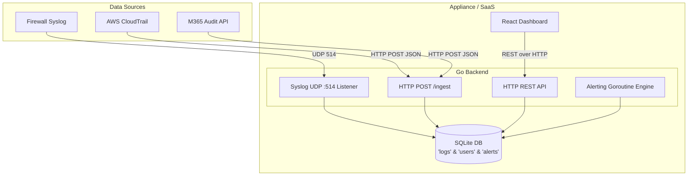

# Architecture Overview

## Tech Stack
- **Database:** SQLite
- **Backend/Ingest API:** Go (Golang) + Fiber Framework
- **Frontend UI:** React (TypeScript) + Vite + TailwindCSS + Recharts

## Component Diagram

## Security & Multi-tenancy
- **Tenant Isolation:** The Go backend extracts the `tenant` claim from the JWT token and appends a `WHERE tenant = ?` clause to all SQL queries unless the user is an `admin` (`tenant="*"`).
- **Authentication:** Users are authenticated via JSON Web Tokens (JWT). Passwords can be hashed (using bcrypt, though simple strings are currently seeded for the demo).
- **Data Normalization:** The ingest endpoint takes arbitrary JSON, extracts key properties (`source`, `action`, `tenant`, etc.) into indexed SQLite columns, and saves the original JSON as a raw payload for future flexibility.
